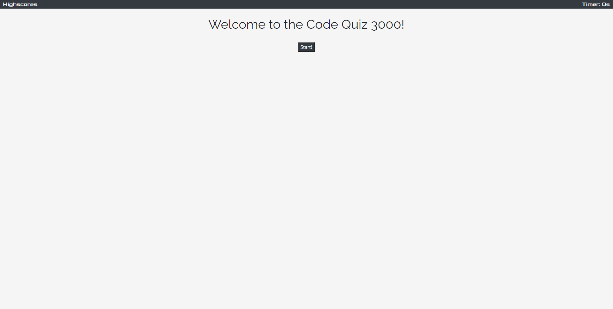
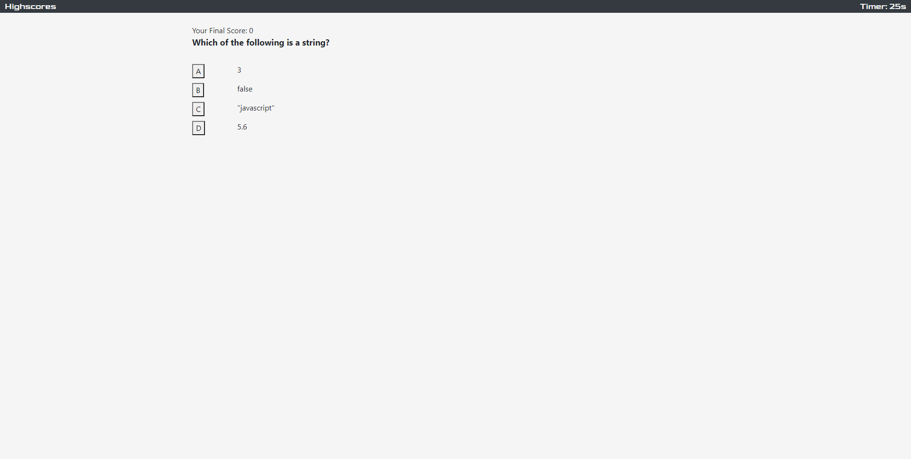
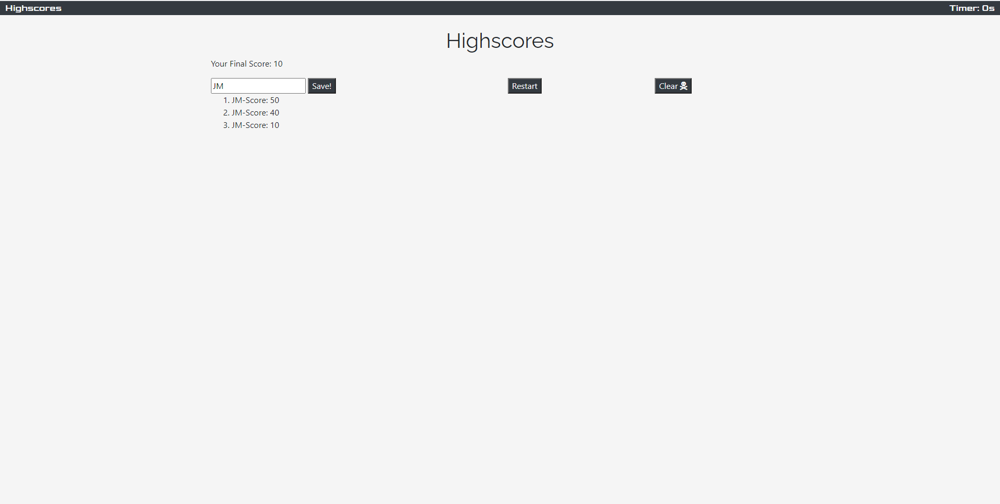

# Code Quiz

## Description:

In this project I created a simple coding quiz. There are 5 questions that always appear in the same order, and the player has 30 seconds to answer all of them. Each question has 4 answers to choose from. If the correct answer is chosen, the player's score increases by 10, otherwise if the answer chosen was wrong, 4 seconds is deducted from the timer. Once the timer reahces zero or the final question is answered, the user is then shown the highscores screen. In the highscores screen there is an option for you to locally save your score, a restart button, and a clear button. Also, if you click the word Highscores in the top left corner of the screen, the user is taken directly to the end of the game, resetting their score to zero as well.

## Previews

The following images preview what the project looks like

